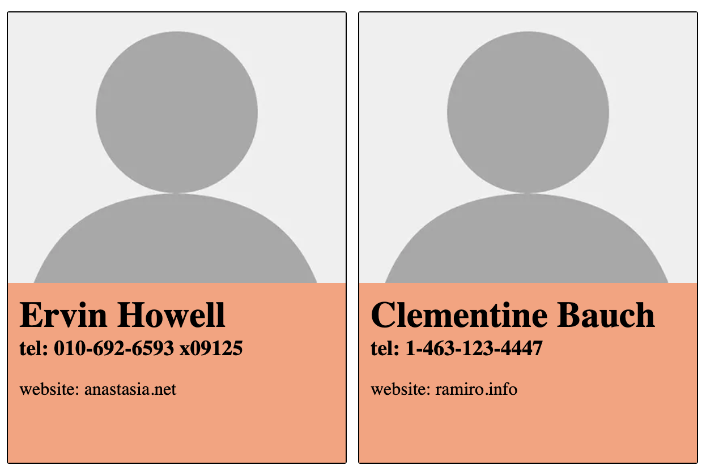

Dzisiaj wykonamy sobie kilka ćwiczeń.
W niniejszym folderze znajduje się zupełnie pusta templatka reactowego projektu.

Zaciągnijcie najświezszą wersję tego repozytorium, następnie przepnijcie się w terminalu na folder `02-integration` i puśćcie komendię `npm i`.

Gdy zainstalują się `node_modules`, odpalcie projekt.

## Zadanie 1

Zadanie polega na stworzeniu prostego licznika, którego stan, będzie przechowywany przy pomocy `useState`.

Aktualna wartość licznika ma być wyświetlana w polu `<input />`.
Oprócz tego layout zawierać powinien dwa przyciski `+` i `-` po naciśnięciu których aktualny stan licznika zmieniać się będzie odpowiednio o **+1** lub **-1**.

Zdefiniuj funkcje `increaseValue` i `decreaseValue` odpowiedzialne za zwiększanie i zmniejszanie wartości licznika.

## Zadanie 2

Na ekranie chcemy wyświetlić pole `<input />` oraz przycisk słuzący do aktualizowania wewnętrznego stanu komponentu, który kontrolować będziemy przy pomocy `useState`.

Zadanie polega na tym, by kazde naciśnięcie przycisku spowodowało zakutalizowanie stanu komponentu, będącego tablicą obiektów o kształcie jak np.:

```javascript
{
    ordinalNumber: 3,
    value: "kalarepa",
}
```

o kolejny taki obiekt, którego `value` to wartość wzięta z pola `<input />`.

Uwaga:

- po kazdej aktualizacji stanu, pole input powinno zostać wyczyszczone
- stanu nie nalezy aktualizować, gdy pole input nie zawiera zadnej treści
- po próbie aktualizacji stanu przy pomocy pustego pola input, nalezy wyświetlić komunikat błedu (stylowanie dowolne).

\* stwórz osobny komponent `<Button>` i nadaj mu unikalne style.

## Zadanie 3

Stwórz komponent `<Card />`, którego zadaniem będzie wyświetlenie treści obiektu z tablicy przechowującej stan komponentu z zadania 2.

Uzyj komponentu do wyrenderowania treści obiektów ze stanu.

Style dowolne :)

## Zadanie 4.

Stwórz komponent/-y, potrzebne do wyświetlenia na ekranie danych dostępnych pod API `https://jsonplaceholder.typicode.com/users`.

Przykładowo:


Zastanów się, co od strony technicznej będzie Ci potrzebne by wykonać to zadanie. Podnieś wszelkie pytania odnośnie części niezrozumiałych lub wzbudzających wątpliwości.

Następnie sporządź plan i zakoduj tę aplikację.

Style dowolne ;)
