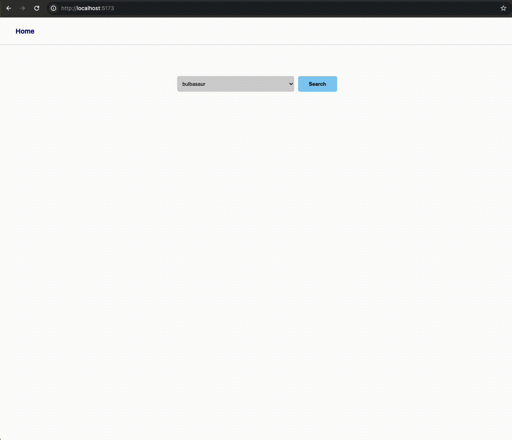

# Pokedex

Podczas dzisiejszych zajęć wykonacie kilka zadań, które ostatecznie doprowadzą nas do zakodowania funkcjonalnej aplikacji pokedex w oparciu o pokeapi.



Działającą stronę mozecie podejrzeć na: https://example-pokedex.netlify.app/

Podstawowe API, z którego będziecie musieli skorzystać jest pod adresem:
https://pokeapi.co/api/v2/pokemon?limit=10000

## I. Baza

    1. Utwórz projekt react korzystając z `yarn create vite`.
    2. Zainstaluj `react-router-dom`.
    3. Oczyść projekt ze zbędnych plików lub ich treści. W index.css możesz wkleić np. https://www.joshwcomeau.com/css/custom-css-reset/
    4. Skonfiguruj BrowserRouter w `main.jsx` i `App.jsx`
        - w `main.jsx` chcemy sprawić, by punktem startowym dla naszej aplikacji był `<App />`
        - w `App.jsx` chcemy sprawić, by `<Layout>`, który zawierać będzie pasek nawigacyjny, był wyświetlany na każdej stronie aplikacji.
        - pod ścieżką `/` ma być dostępny kontener "Search" (na ten moment nie utworzony)
        - pod ścieżką `pokemon/:pokemonName` ma być dostępny kontener `<Pokemon>`

## II. W toku pracy utworzysz kilka kontenerów i komponentów. Na potrzeby utrzymania logicznego porządku w pracy, przyjmujemy, że kontener to taki reactowy komponent, do którego prowadzi jakaś ścieżka w routingu, np. kontenerem jest `<Pokemon />` ponieważ prowadzi do niego ścieżka `pokemon/:pokemonName` i może on zawierać inne komponenty.

    1. Utwórz foldery `/containers`, `/components` i `/context`.
    2. W folderze `/container` utwórz `<Layout />` a w nim menu nawigacyjne pozwalające na powrót pod ścieżkę `/`.
    3. Wyodrębnij menu nawigacyjne do osobnego komponentu `<Navbar />`.
    4. Wykorzystaj CSS do zdefiniowania, że kontener, w którym zawiera się `<Navbar />` zajmuje `70px` od góry view portu, a resztę przestrzeni zajmuje zawartość tagu `<main>` (pamiętaj, że każda podstrona naszej aplikacji będzie wyświetlana jako część `<Layout />`. Innymi słowy pasek nawigacyjny ma być wyświetlany na każdej podstronie).
    5. Wykorzystaj własność `<NavLink>` do zdefiniowania kolorystki linku w zależności od tego, czy aktualnie znajdujemy się pod ściężką `/` czy nie.
    6. Zaimportuj kontener `<Layout />` do `App.jsx`
    7. Utwórz kontenery `Pokemon` i `Search` (póki co o dowolnej treści).
    8. Kontenery z pkt 5. również zaimportuj do `App.jsx`

## III. Zdefiniuj `<PokemonContext>`.

    1. PokemonContext ma być dostępny w całej aplikacji.
    2. Domyślny stan kontekstu to obiekt, zawierający następujące pola:
    ```
    {
        loadingPokemonList: "idle",
        loadingPokemonData: "idle",
        pokemonList: [],
        selectedPokemonUrl: null,
        pokemonData: null,
    }
    ```
    3. Po załadowaniu się aplikacji, odbywa się zapytanie do API: https://pokeapi.co/api/v2/pokemon?limit=10000

        - Przed zapytaniem loadingPokemonList ustawiamy na "pending", po zapytaniu na "resolved", w przypadku błędów ustawiamy go na "rejected".
        - resultat zapytania zapisujemy w pokemonList,

## IV. Zdefiniuj formularz w kontenerze `<Search>`:

    1. formularz zawiera pole `<select>` wraz z opcjami `<option>`, do których mapujemy zawartość pokemonList z PokemonContext.
    2. `<select>` powinien wyświetlać listę wszystkich pokemonów, zaś wartość elementu `option` stanowić ma `url`, pod którym dostępne są dane na temat konkretnego pokemona.
    3. po naciśnięciu "submit" odbywa się zapytanie pod adres API konkretnego pokemona, w wyniku którego otrzymujemy dane, które należy zapisać pod pokemonData wewnątrz PokemonContext.

## V. Utwórz komponent `PokemonTile`, który wyświetlisz wewnątrz komponentu `Search`.

    1. Komponent ten ma wyświetlać nazwę pokemona, przedstawiający go obrazek oraz link do podstrony `pokemon/:pokemonName`
    2. W obrębie komponentu `Pokemon` wyświetl szczegółowe informacje na temat zdolności pokemona. Wybierz 5 takich, które zawierając jakieś dane (niektóre pola w obrębie pokemonData są puste dla wielu pokemonów).

## `*`Spraw, by bezpośrednie wejście pod adres `pokemon/:pokemonName` zwracało ten sam rezultat, co wejście pod ten adres z komponentu `Search`
