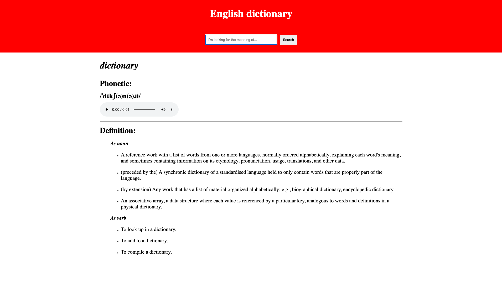

# Projekt React + TypeScript

Cześć 👋

Celem dzisiejszego projektu będzie zbudowanie aplikacji słownika języka angielskiego przy użyciu React i TypeScript.

Dokonamy tego korzystając z [Free Dictionary API](https://dictionaryapi.dev/).

Dodatkowe założenia obejmują:

-  stylowanie z lub bez CSS modules,
-  ContextAPI jako miejsce do przetrzymywania stanu,
-  obecność wskaźnika stanu ładowania danych.

Opcjonalnie:

-  zastosowanie biblioteki [React Hot Toast](https://react-hot-toast.com/) do informowania użytkownika o błędach.

Ćwiczenie rozpoczniemy od zaplanowania jak napisać tę aplikację.

Efekt finalny powinien przypominać funkcjonalność prezentowaną przez poniższy zrzut ekranu:

Przykładowa strona jest dostępna pod adresem: https://ts-dictionary.netlify.app/ (loading indicator nie jest na niej obecny)
